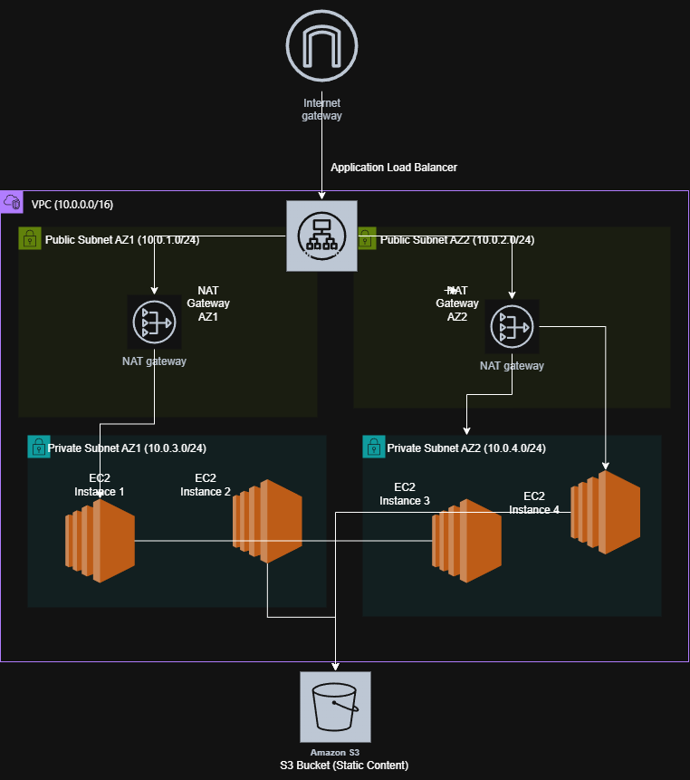
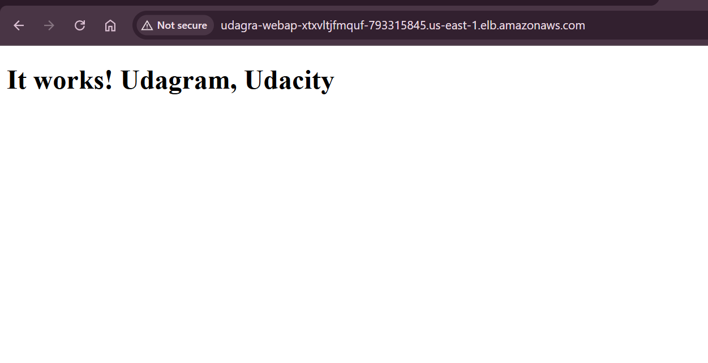
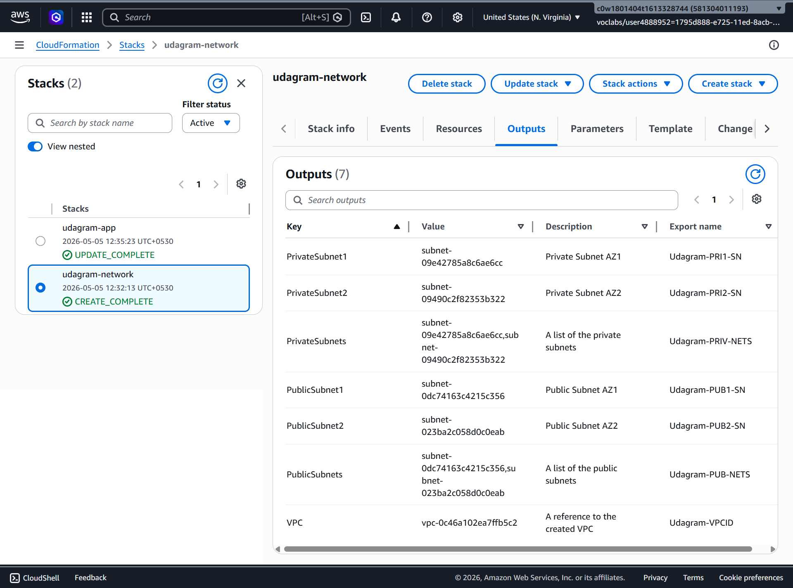
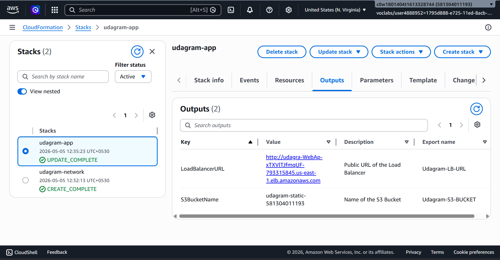
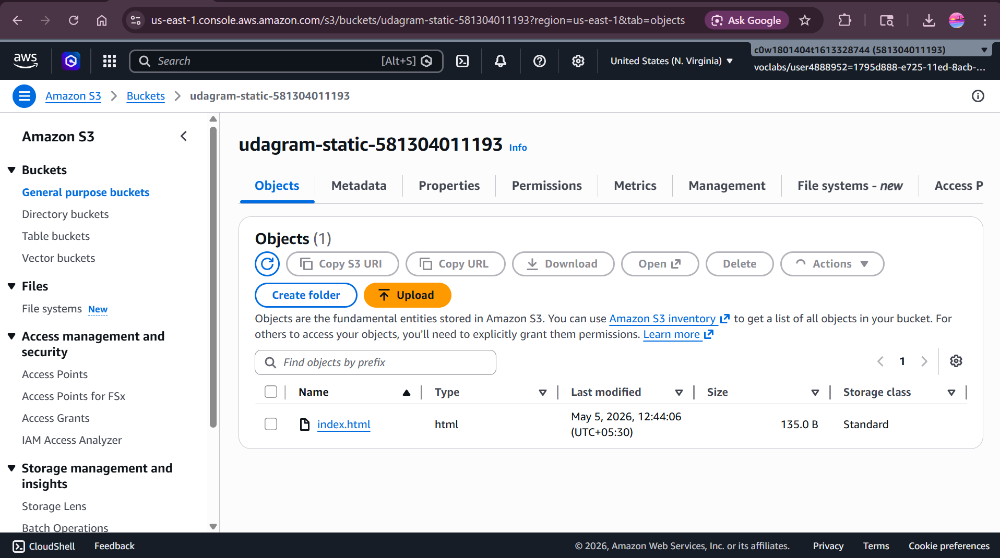

# Udagram - Deploy a High Availability Web App using CloudFormation

## Project Overview
This project deploys a high availability web application (Udagram) on AWS using 
Infrastructure as Code (CloudFormation). The infrastructure includes a VPC, 
public and private subnets, NAT Gateways, an Application Load Balancer, 
Auto Scaling Group, EC2 instances, and an S3 bucket for static content.

## Infrastructure Diagram


## Prerequisites
- AWS CLI installed and configured
- AWS account with appropriate permissions

## Files Structure
├── starter/
│   ├── network.yml                  # Network infrastructure template
│   ├── network-parameters.json      # Network stack parameters
│   ├── udagram.yml                  # Application infrastructure template
│   └── udagram-parameters.json      # Application stack parameters
├── create.sh                        # Script to create stacks
├── delete.sh                        # Script to delete stacks
├── diagram/
│   └── infrastructure-diagram.png   # Architecture diagram
└── README.md

## Deployment Instructions

### 1. Configure AWS CLI
```bash
aws configure
```

### 2. Make scripts executable
```bash
chmod +x create.sh delete.sh
```

### 3. Deploy Network Stack first
```bash
./create.sh udagram-network starter/network.yml starter/network-parameters.json
```
Wait for the network stack to complete before proceeding.
You can check the status in AWS CloudFormation console.

### 4. Deploy Application Stack
```bash
./create.sh udagram-app starter/udagram.yml starter/udagram-parameters.json
```

### 5. Upload static content to S3
```bash
aws s3 cp index.html s3://udagram-static-YOUR_ACCOUNT_ID/
```

### 6. Get the Load Balancer URL
Check the Outputs section of the udagram-app stack in CloudFormation console
or run:
```bash
aws cloudformation describe-stacks --stack-name udagram-app \
--query "Stacks[0].Outputs"
```

## Deletion Instructions

### 1. Empty the S3 bucket first
```bash
aws s3 rm s3://udagram-static-YOUR_ACCOUNT_ID/ --recursive
```

### 2. Delete Application Stack first
```bash
./delete.sh udagram-app
```

### 3. Delete Network Stack
```bash
./delete.sh udagram-network
```

## Evidence
## Evidence

### Working URL
http://udagra-WebAp-xTXVlTJfmqUF-793315845.us-east-1.elb.amazonaws.com

### Screenshot 1 - Website via Load Balancer URL


### Screenshot 2 - Network Stack Outputs


### Screenshot 3 - App Stack Outputs


### Screenshot 4 - S3 Bucket
